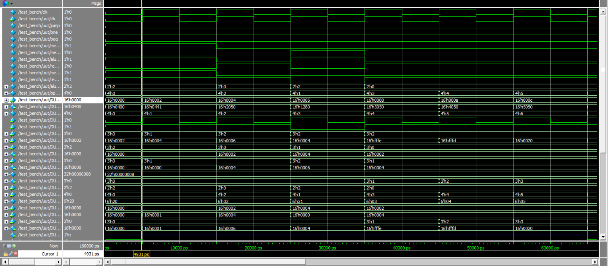

## 16-bit RISC 

A reduced instruction set computer, or RISC (/rɪsk/), is a computer instruction set that allows a computer's 
microprocessor to have fewer cycles per instruction (CPI) than a complex instruction set computer (CISC).
The proposed design implements the chip design on top of Harvard Architecture. The processor width is 
16bit and have 8 General Purpose Registers with dedicated instruction and data memory. The default Instruction and 
Data cache size are given in the 'parameter.v' file, along with the data width and other runtime parameters.
The verilog code was written and simulated to test the design and workflow. 

The architecture does not support pipelining. 

# The instruction set of the RISC processor:

A. Memory Access Instructions
1. Load Word:
               LD ws, offset(rs1) ws:=Mem16[rs1 + offset]
2. Store Word:
               ST rs2, offset(rs1) Mem16[rs1 + offset]=rs2

B. Data Processing Instructions
1. Add:
               ADD ws, rs1, rs2 ws:=rs1 + rs2
2. Subtract:
               SUB ws, rs1, rs2 ws:=rs1 – rs2
3. Invert (1‘s complement):
               INV ws, rs1 ws:=!rs1
4. Logical Shift Left:
               LSL ws, rs1, rs2 ws:=rs1 << rs2
5. Logical Shift Right:
               LSR ws, rs1, rs2 ws:=rs1 >> rs2
6. Bitwise AND:
               AND ws, rs1, rs2 ws:=rs1 • rs2
7. Bitwise OR:
              OR ws, rs1, rs2 ws:=rs1 | rs2
8. Set on Less Than:
             SLT ws, rs1, rs2 ws:=1 if rs1 < rs2; ws:=0 if rs1 ≥ rs2

C. Control Flow Instructions
1. Branch on Equal:
               BEQ rs1, rs2, offset
               Branch to (PC + 2 + (offset << 1)) when rs1 = rs2
2. Branch on Not Equal:
              BNE rs1, rs2, offset
              Branch to (PC + 2 + (offset << 1)) when rs1 != rs2
3. Jump: JMP offset Jump to {PC [15:13], (offset << 1)}

Simulation results:

Detailed documentation is provided along with the repository.

